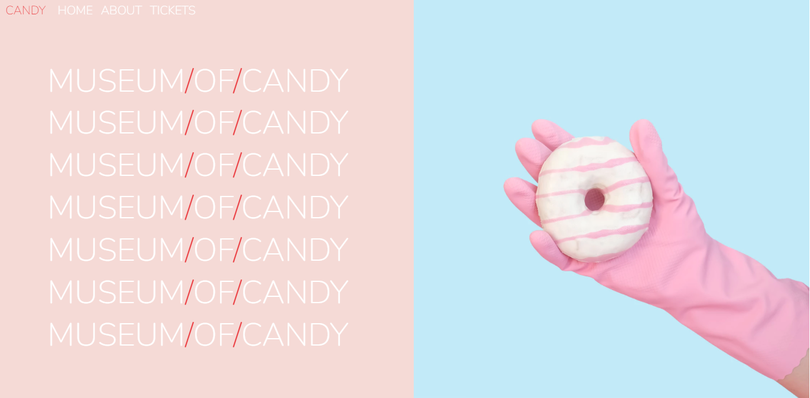

# Museum of Candy Project - Web Developer Bootcamp 2023

This is a solution to the [Museum of Candy Project - The Web Developer Bootcamp 2023](https://www.udemy.com/course/the-web-developer-bootcamp/). 

## Table of contents

- [Overview](#overview)
  - [Screenshot](#screenshot)
  - [Links](#links)
- [My process](#my-process)
  - [Built with](#built-with)
  - [What I learned](#what-i-learned)
  - [Continued development](#continued-development)
- [Author](#author)

## Overview

### Screenshot

### Links

- Solution URL: [GitHub Project Page](https://github.com/micamash/museum-of-candy)
- Live Site URL: [Museum of Candy](https://micamash.github.io/museum-of-candy/)

## My process

### Built with

- HTML
- CSS Bootstrap
- Javascript

### What I learned

I gained more experience using CSS with Bootstrap. I utilized Javascript for the nav bar as well to transition in a background color upon scrolling.

### Continued development

I would like to continue learning more about Bootstrap and Javascript in my future projects.

## Author

- Website - [My GitHub](https://github.com/micamash)
- Colt Steele's [The Web Developer Bootcamp 2023](https://www.udemy.com/course/the-web-developer-bootcamp/)
